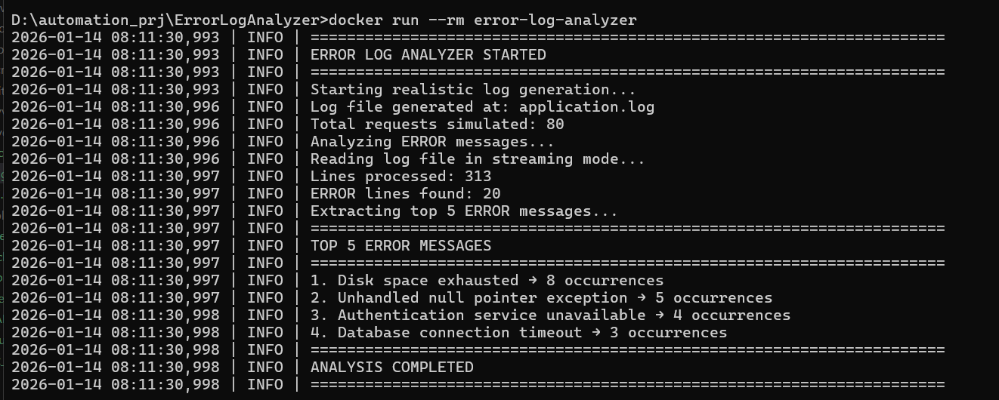
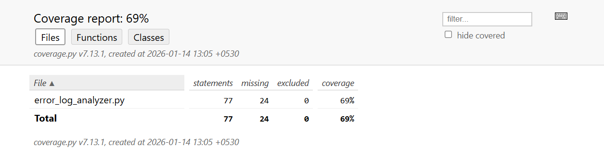

## 📌 Error Log Analyzer (Memory Efficient)

**Error Log Analyzer** is a production-ready, memory-efficient Python application designed to analyze large-scale application log files and identify the most frequent **ERROR** messages without loading the entire file into memory.

The project demonstrates **real-world backend and platform engineering practices**, including streaming file processing, defensive parsing of logs, automated testing with coverage, containerization using Docker, and reproducible execution across environments.

It is built to scale from **local development** to **containerized execution**, making it suitable for log analysis, observability pipelines, and backend system diagnostics.


### 🔍 Key Highlights

* **Memory-efficient log processing** using generators to safely handle very large log files (10GB+)
* **Structured log parsing** for `[TIMESTAMP] [LEVEL] [MESSAGE]` formatted logs
* **Accurate aggregation** of frequent ERROR messages using efficient data structures
* **Comprehensive unit testing** with `pytest` and test coverage reporting
* **Dockerized application** for consistent, portable execution across systems
* **Clean project structure** following industry best practices
* **Production-oriented tooling** (pytest, coverage, Docker, GitHub-ready)

---

### 🛠️ What This Project Demonstrates

* Backend engineering fundamentals (file I/O, streaming, parsing, aggregation)
* Performance and memory optimization techniques
* Test-driven development mindset
* DevOps and containerization workflows
* Practical troubleshooting and environment setup (Docker, WSL, coverage tooling)

---


## Features

- Streaming file processing (10GB+ safe)
- Behavior-driven log generation
- Generator-based I/O
- defaultdict-based aggregation
- Top-K ERROR extraction
- Unit tested with coverage
- Dockerized for portability

---

---

## ▶️ How to Run This Project (For Users)

This project can be run in **two ways**:

1. **Locally using Python**
2. **Using Docker (recommended for consistency)**

---

# 🔹 Option 1: Run Locally (Python)

### ✅ Prerequisites

* Python **3.10+**
* Git installed

---

### 📥 Step 1: Clone the Repository

```bash
git clone https://github.com/namankabadi/error-log-analyzer.git
cd error-log-analyzer
```

---

### 🧪 Step 2: Create Virtual Environment (Recommended)

#### Windows

```bash
python -m venv venv
venv\Scripts\activate
```

#### Linux / macOS

```bash
python3 -m venv venv
source venv/bin/activate
```

---

### 📦 Step 3: Install Dependencies

```bash
pip install -r requirements.txt
```

---

### ▶️ Step 4: Run the Application

```bash
python error_log_analyzer.py
```

📌 This will:

* Generate a sample `application.log`
* Analyze logs in a **memory-efficient** way
* Print the **Top 5 most frequent ERROR messages**

---

### 🧪 Step 5: Run Tests (Optional but Recommended)

```bash
pytest tests
```

---

### 📊 Step 6: Run Tests with Coverage (Optional)

```bash
pytest tests --cov=error_log_analyzer --cov-report=term --cov-report=html
```

Coverage report will be generated in:

```
htmlcov/index.html
```

---

# 🔹 Option 2: Run Using Docker (Recommended)

This option requires **Docker Desktop** installed and running.

---

### 🐳 Step 1: Pull Image from Docker Hub

```bash
docker pull namankabadi/error-log-analyzer:latest
```

---

### ▶️ Step 2: Run the Container

```bash
docker run --rm namankabadi/error-log-analyzer:latest
```

📌 This will:

* Run the analyzer inside a container
* Execute the application automatically
* Print results to the terminal
* Remove the container after execution

---

### 💾 (Optional) Persist Logs to Local System

```bash
docker run --rm -v %cd%:/app namankabadi/error-log-analyzer:latest
```

(Linux/macOS: `-v $(pwd):/app`)

---

# 🔹 Expected Output

```
ERROR LOG ANALYZER STARTED
Lines processed: 180
ERROR lines found: 42

Top 5 ERROR Messages:
1. Database connection timeout → 14 occurrences
2. Authentication service unavailable → 9 occurrences
3. Disk space exhausted → 7 occurrences
...
```

---
# System Outputs:


# Coverage Report:


# 🔹 Troubleshooting

### ❌ `ModuleNotFoundError`

Ensure virtual environment is activated and dependencies are installed.

### ❌ Docker daemon not running

Start **Docker Desktop** and retry.


---

# 🔹 Project Highlights

* Memory-efficient log processing (line-by-line streaming)
* Suitable for **large log files (10GB+)**
* Fully tested with **pytest**
* Dockerized for **portable execution**
* CI/CD ready

---

## 👨‍💻 Author

**Naman Kabadi**  
Software Engineer


---


